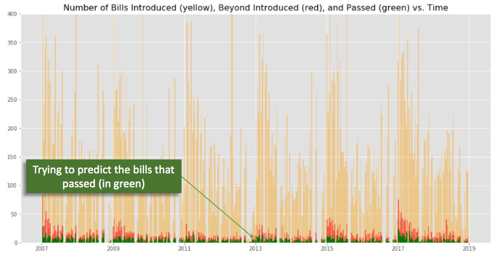
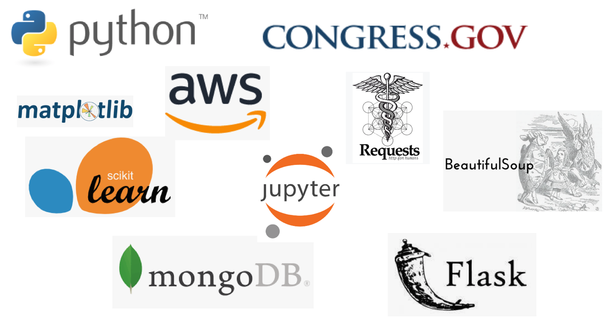
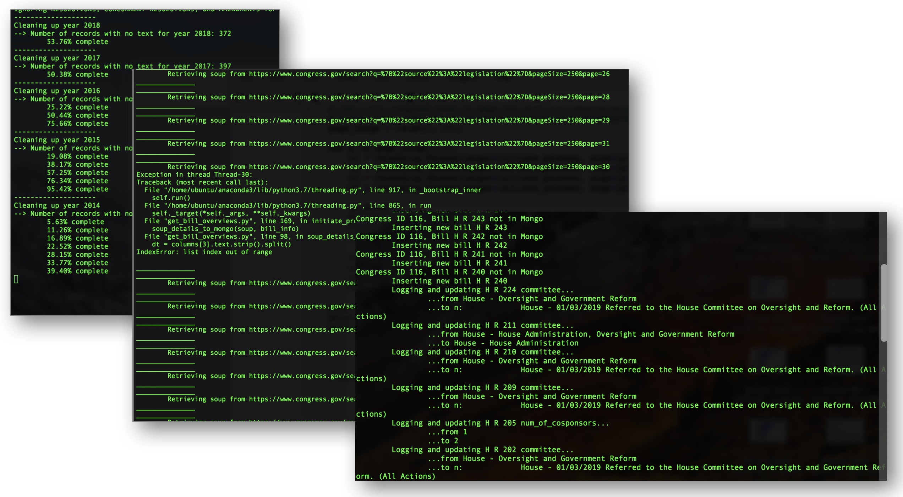
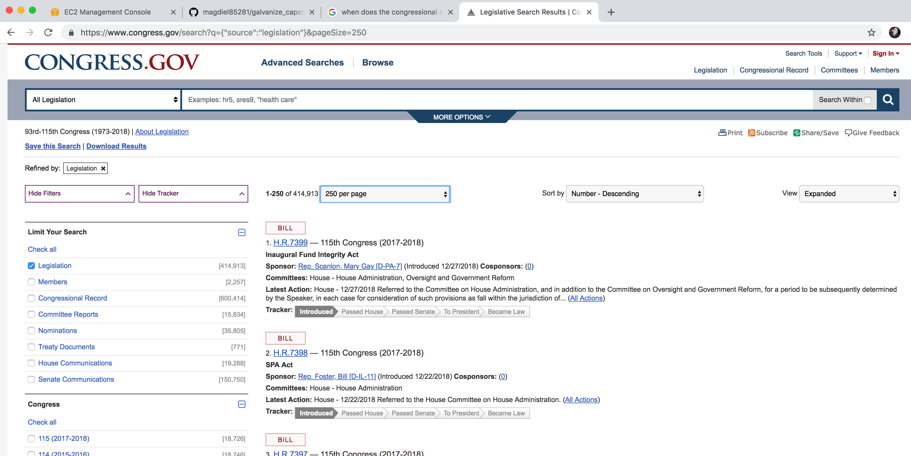
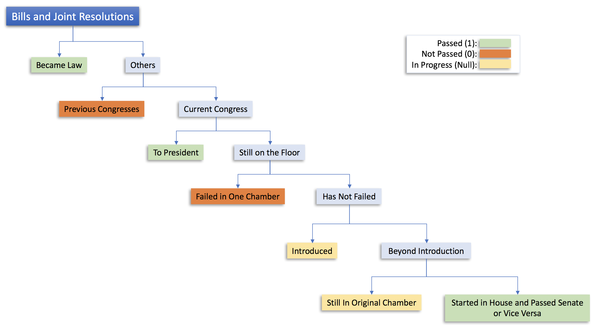
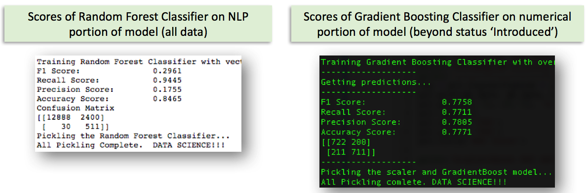
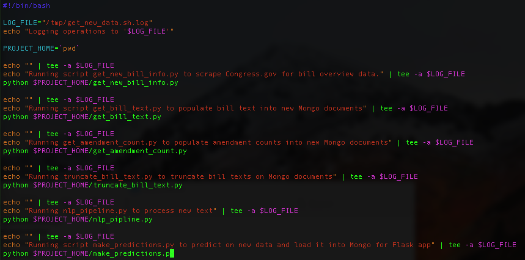
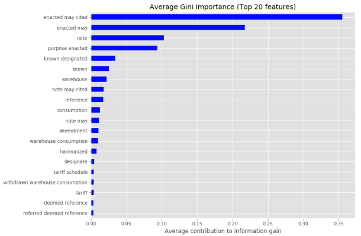

# Will It Pass?

## Project Overview

This project is an attempt to predict whether a bill or a joint resolution will pass both chambers of Congress based primarily on the text of the bill. The focus was only on these forms of legislation because others, such as simple and concurrent resolutions, do not carry the force of law when passed. Check out [Legislation, Laws, and Acts](https://www.senate.gov/legislative/common/briefing/leg_laws_acts.htm) for definitions and examples. 

Upon my research into this subject, it surprised me that fewer than 5% of the bills and joint resolutions introduced in Congress ever make it into law. The number increases to 37% if they make it out of the originating chamber.

## The Resources

### Local Machine, AWS, and tmux
Preliminary work for this project started on a local machine. Messages were regularly included in the code to print out to the terminal to notify the user of the process status and whether any errors occurred during a process. Best practice would have been to have these messages print out to a log from inception. This practice was incorporated later in the process.

OnceI built confidence in the process, everything was migrated into a Ubuntu 18.04 EC2 instance in [Amazon Web Services](https://aws.amazon.com). Once EC2 became the primary "base of operations", the use of [tmux](https://en.wikipedia.org/wiki/Tmux) became an essential tool in order to stay connected. Since web scraping - which incorporated sleep time - and model training took an extraordinary amount of time to complete, tmux allows the user to start a script and detach from it so it continues to run regardless of whether the local machine is connected.

### Python and Mongo
Python was used to scrape the initial data from [congress.gov](https://www.congress.gov/search?q={%22source%22:%22legislation%22}&pageSize=250) using the Requests and BeautifulSoup packages. The data collected was put into json or dictionary format and stored into a Mongo collection. 

### my_tools.py
The python script my_tools.py was created specifically for this project to write and read logs and files, format data from Mongo, put bill text through a Natural Language Processing pipeline, and other functions which were used regularly during scraping, exploration, and modeling of the data.

## The Process

### Step 1: Data Wrangling
To begin, general information from bills and joint resolutions were scraped from the Legislation search pages on [Congress.gov](https://www.congress.gov/search?q={%22source%22:%22legislation%22}&pageSize=250). 

From these pages, most fields and url links for each piece of legislation were scraped using threads and dumped into a Mongo database for analysis. Once in Mongo, this data was then referenced to scrape additional bill details from the urls stored - such as the bill text, the number of amendments, and cosponsor information.

### Step 2: Labeling
If a bill or joint resolution gathered enough votes to [pass](https://www.usa.gov/how-laws-are-made) both the Senate and the House of Representatives, it was labeled as 'passed', or '1'. If it failed in one chamber, failed in committee, or never got voted on by the end of the legislative session, it was labeled as 'not passed', or '0'. Those remaining were deemed 'in progress'. 

### Step 3: Modeling

The predictions were be primarily based on [Natural Language Processing](https://en.wikipedia.org/wiki/Natural_language_processing) using [n-grams up to 4 words](https://en.wikipedia.org/wiki/N-gram) of the bill text. In order to do this, the text was first vectorized using sklearn's [TFIDF Vectorizer](https://scikit-learn.org/stable/modules/generated/sklearn.feature_extraction.text.TfidfVectorizer.html) to create numerical representations of the text. This created a dataset that approached 30 million features. With the EC2 instance that I selected, I was able to vectorize 6 million of the most frequently occuring features and fit half of those to a [Random Forest Classifier](https://scikit-learn.org/stable/modules/generated/sklearn.ensemble.RandomForestClassifier.html).

After a few iterations, I discovered that the proportion of bills that pass increases 7-fold once they've passed the chamber they were introduced in. To account for this, I complemented the NLP model with a [Gradient Boosting](https://scikit-learn.org/stable/modules/generated/sklearn.ensemble.GradientBoostingClassifier.html) classification model on the numerical data.

I decided on using [recall, or sensitivity](https://en.wikipedia.org/wiki/Sensitivity_and_specificity) as the preferred measure to score my models on because of the imbalance in the classes (remember, less than 5% of bills pass). Based on the recall scores received during cross-validation, I initially - and arbitrarily - decided on weighing the predictions of each model equally. Continuation of this project would take the Bayesian approach of adjusting the weights as new bills passed.

### Step 4: Making and Showing Predictions
The data on [Congress.gov](https://www.congress.gov/search?q={%22source%22:%22legislation%22}&pageSize=250) is updated daily. So, in order to include this data in the project, get_new_data.sh was created to run several python scripts in successsion daily that scrapes the data from the most recent congressional session, compares certain fields to documents already stored in Mongo, and adds, updates, and formats documents as needed.

The predictions on the new data are created by running it through make_predictions.py. This script transforms and makes predictions on the data based on the previously pickled models, accounting for the fact that some of those bills that have already passed one chamber. The predictions of each the Random Forest (bill text) and the Gradient Boosting (numerical data) Classifiers, along with the blended predictions, are stored in Mongo. These results are then queried by mongo_to_flask.py for the Flask app to display on a browser.

## Results
Early in the project, I used Multinomial Naive Bayes to model the vectorized text. This gave me recall scores in the realm of 53% - 57%. Not bad, but I was hoping for scores in the neighborhood of the 70's.

The next few iterations involved sklearn's Random Forest Classifier. This resulted in recall and f1 score of 98% - 99%. These scores are great!... but too good. This  _screamed_ data leakage, meaning there was something in the text itself that indicated the bill had passed.

Once the data leakage was (mostly) plugged up, I felt more confidence in my findings. Below are the largest factors and types of bills that determine whether a bill will pass, in descending order (the image below shows that same after references to the first two items have been removed): 

* Multiple references to U.S. Codes (permanent laws). Speculation: bills that supplement or amend previously existing laws are more likely to pass than bills that are entirely new.
* Catering to the constituency of those sponsoring the bill in the form of renaming a federal building (i.e. U.S. Post Office) to commemorate a person or group.
* Named bills, like the "Pandemic and All-Hazards Preparedness and Advancing Innovation Act of 2019" (an indicator that the bill has passed in the originating chamber)
* Food and beverage consumption
* Tariffs

### Additional Information
The 115th Congress ended on January 3, 2018. Every bill and joint resolution that hasn't become law by the end of that day was labeled as "not passed". 
