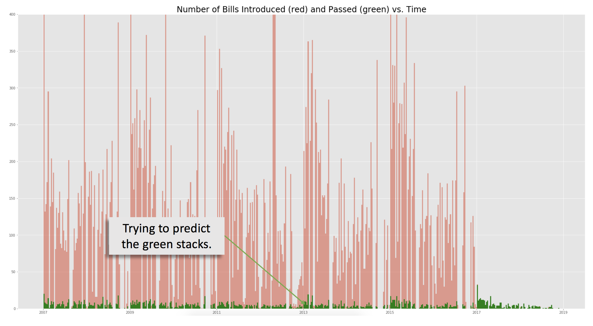

#Project Overview

This project is an attempt to predict whether a bill will gather enough votes to pass both chambers of Congress. Upon my research into this subject, it surprised me that fewer than 10% of all bills introduced ever make it into law. The graphic below should give you an idea of the (astonshing) number of bills that get introduced and the proportion of those that actually become law.

